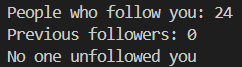

<h1 align="center" id="title">Who Unfollowed Me?</h1>

<p align="center"></p>

<p id="description">A python project that checks who has unfollowed you on Instagram.</p>

<p align="center"></p>

 <h2> Project Output 😃</h2> 

  
<h2>🧐 Features</h2>

Here're some of the project's best features:

*   🌟 User friendly
*   💥 Secure

<h2>🛠️ Installation Steps:</h2>

<p>1. Create a virtual Environment</p>

```
python -m venv EnvName
```

<p>2. Activate it</p>

```
EnvName\Scripts\Activate
```

<p>3. Install requirements</p>

```
pip install -r requirements.txt
```

  
  
<h2>💻 Built with</h2>

Technologies used in the project:

*   Python

<h2>🛡️ License:</h2>

This project is licensed under the MIT